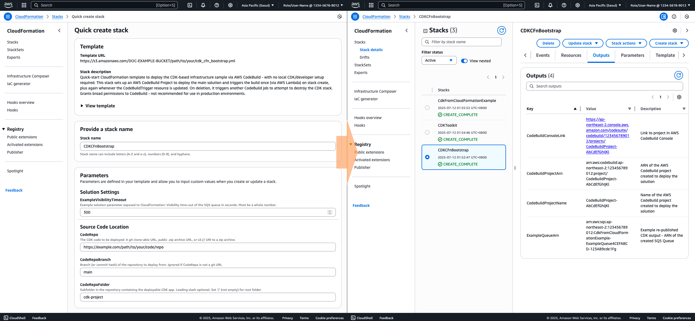

# One-click AWS deployment, whatever your IaC framework

This repository shares re-usable patterns for packaging your {CDK, Terraform, Pulumi} projects inside [AWS CloudFormation](https://docs.aws.amazon.com/AWSCloudFormation/latest/UserGuide/Welcome.html) templates for easy sharing and deployment.

## Why?

AWS CloudFormation offers an easy, streamlined way to share Cloud applications and templates that anybody can deploy - as long as they have access to (and sufficient permissions in) their target AWS Account.

If you upload your template to an Amazon S3 bucket, you can even share a link like the one below, which will walk users through the process of configuring and deploying your stack:

...But many builders work with other [Infrastructure as Code](https://aws.amazon.com/what-is/iac/) tools too, for a range of reasons:

- [AWS CDK](https://docs.aws.amazon.com/cdk/v2/guide/home.html) supports defining infrastructure in programming languages (including TypeScript, JavaScript, Python, Java, C#/.Net, and Go), which can provide a higher-level and more easily (re)-usable interface than writing raw template YAML/JSON.
- [Hashicorp Terraform](https://developer.hashicorp.com/terraform) (and [OpenTofu](https://opentofu.org/)) support multiple Clouds and other custom resources.
- [Pulumi IaC](https://www.pulumi.com/product/infrastructure-as-code/) offers programming language-based infrastructure definition (TypeScript, Python, C#/.NET, Go, and Java) with Terraform compatibility and support for multiple Clouds.

All of these tools are valuable to builders, but require extra installation or setup steps before the person receiving your code can deploy it.

## Solution overview

We provide example single-file 'bootstrap' CloudFormation templates that, in general, run [AWS CodeBuild](https://docs.aws.amazon.com/codebuild/latest/userguide/welcome.html) jobs to fetch the source code and run deployment of your underlying project authored in a different Infrastructure as Code language. This enables you to offer a straightforward CloudFormation-based deployment experience, for an underlying solution built in some other IaC tooling.

 whose deployment runs an AWS CodeBuild job, that fetches and runs deployment of your actual IaC project")

> ⚠️ **Note:** These sample templates and projects are provided to illustrate the pattern of wrapping IaC projects with CloudFormation templates for simplified deployment, but have not had their associated IAM permissions fully minimized. Before using this pattern in production environments, we recommend you review where IAM permissions can be minimized and how deployment of the bootstrap CodeBuild job (which will have quite broad permissions to deploy your solution) affects security in your AWS Account in general (for example, what other users and roles might have access to CodeBuild).

From our experience applying this pattern to share samples, we address more advanced considerations like:

- Exposing input configuration parameters from your underlying solution to users through the bootstrap template
- Waiting for the CodeBuild job to complete, so the bootstrap template doesn't show as successfully deployed until the underlying solution is ready
- Publishing outputs from the solution deployment back to CloudFormation, to make them visible to your users or use them in other CloudFormation resources.

## Get started

The pattern is essentially the same regardless of which IaC tool you'd like to use, but it's easiest to demonstrate with reference to an example project. Check out:

- [cdk-project](cdk-project/README.md) - Example project with AWS CDK (TypeScript)
- [terraform-project](terraform-project/README.md) - Example project with Terraform
- 👷 **Coming soon** - Example project with Pulumi

## Security

See [CONTRIBUTING](CONTRIBUTING.md#security-issue-notifications) for more information.

## License

This library is licensed under the MIT-0 License. See the LICENSE file.
